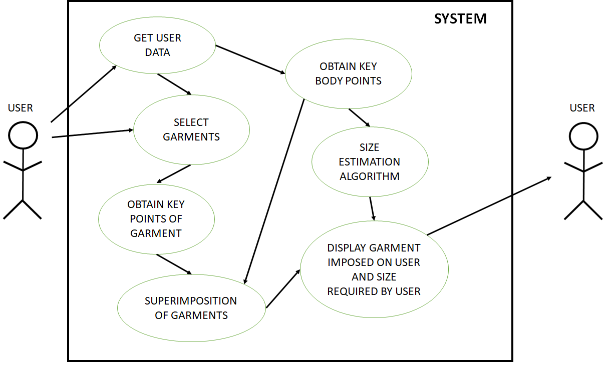
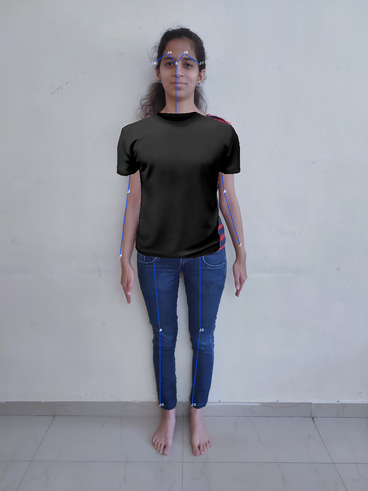
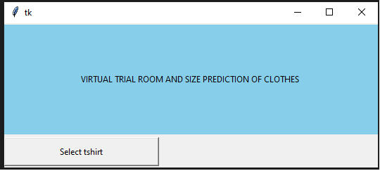
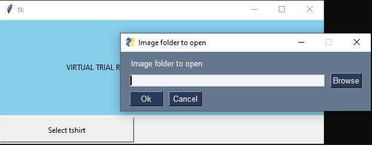
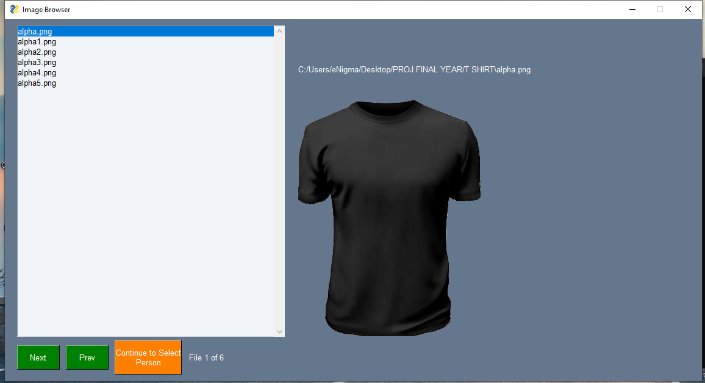

# 👕 Virtual Trial Room & Size Prediction System

A patent-published desktop application designed to simulate a **Virtual Fitting Room (VFR)** experience. This system predicts users’ apparel sizes and enables virtual garment try-ons using webcam images—enhancing accessibility, reducing trial room queues, and minimizing return rates in retail and e-commerce.

---

## 📌 Overview

This project leverages **pose estimation**, **image superimposition**, and **real-time processing** to deliver an interactive virtual try-on experience. By analyzing user body proportions via webcam or smartphone, the system predicts size and overlays garments virtually—eliminating the need for physical trials.

---

## 🧠 How It Works

  

1. Capture user image via webcam.  
2. Detect key body points using pose estimation.  
3. Calculate distances to predict size (e.g., Small, Medium, Large).  
4. Superimpose selected garment image onto the user.  
5. Display predicted size and try-on result on GUI.

---

## 🖼️ Sample Output

### 👤 Pose Estimation with Garment Overlay

  

---

## 💻 Application Screenshots

### Main Interface (Tkinter GUI)

  

---

### Folder Picker for Garment Selection

  

---

### Garment Selection Window

  

---

## ✨ Key Features

- **Size Prediction**: Automatically suggests garment size based on body measurements from the image.
- **Virtual Try-On**: Displays the selected garment superimposed on the user image.
- **Brand-Agnostic Sizing**: Neutral to brand-specific size definitions.
- **Accessible Interface**: Useful for differently-abled individuals.
- **Retail & Online Applications**: Reduces returns and improves customer experience.

---

## 🛠️ Tech Stack

- **Languages**: Python, MATLAB  
- **Libraries**: OpenCV, Tkinter  
- **Functionality**: Pose Estimation, Image Processing, GUI Design

---

## 📄 Patent Info

- **Application No.** 202121039172  
- **Published in:** Indian Patent Journal (36/2021)  
- **Date:** 3rd September 2021

---

## ✅ Conclusion

The Virtual Trial Room system bridges the gap between convenience and personalization in apparel shopping. It minimizes trial errors, streamlines customer journeys, and supports inclusive retail. Future enhancements could include a larger garment database and AI-driven recommendations.

---

_For setup and source code, refer to the main script files and folders in this repository._
